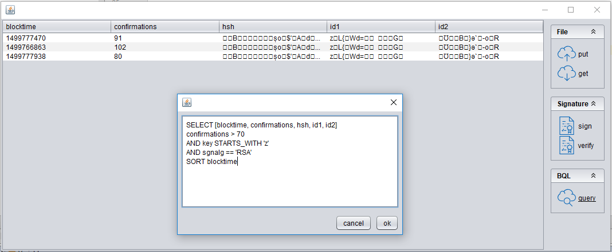

# pdfChain: (experimental) blockchain for the masses

## What is a blockchain?

A blockchain is a distributed database that is used to maintain a continuously growing list of records, called blocks. 
Each block contains a timestamp and a link to a previous block. 
A blockchain is typically managed by a peer-to-peer network collectively adhering to a protocol for validating new blocks. 
By design, blockchains are inherently resistant to modification of the data. 
Once recorded, the data in any given block cannot be altered retroactively without the alteration of all subsequent blocks and a collusion of the network majority. 
Functionally, a blockchain can serve as "an open, distributed ledger that can record transactions between two parties efficiently and in a verifiable and permanent way. 
The ledger itself can also be programmed to trigger transactions automatically."

## Why should you use it?

A blockchain supersedes older technology that deals with authentication and non-repudiation.
First, there are many ways you can sign a document.
Typically by "signing" we mean creating a hash of a document and storing it.
With a blockchain, the useful part is that once such a hash is stored, it can not be changed or deleted. This gives you two advantages:

1. The hash itself identifies the file from which it was computed
2. The fact that your hash is in the blockchain gives you a point in time when the operation was done.

Later you can say: 
Hey, I’ve created this hash on 10 Oct 2016: here is the transaction in the blockchain which contains the hash. I’ve created it according to this formula from this file. 
Now any person can take your file and compute the hash again and verify that it matches the one stored in the blockchain. 
All this works because:

1. It is very easy to compute the hash from a file but very difficult to craft a similar file which will produce exactly the same hash.
2. It is practically impossible to change the data stored inside blockchain.
3. Every transaction in the blockchain has a timestamp, so having the transaction we know exactly when it was done.

The default iText implementation of the blockchain concept is specifically geared towards pdf documents. It stores:
 - a *hash value* of the document
 - the name of the algorithm that was used for *hashing*
 - a *signed hash value* of the document
 - the name of the algorithm that was used for *signing*
 - the pdf ID array
 
This allows you not only to store hash values of documents, but also to digitally sign them.
Being able to swap the hashing algorithm (in case of hashing algorithms becoming outdated) enables LTV (long term validation).

## What does iText provide?

### Interfaces that hide implementation details

The interfaces we impose on blockchain implementations are minimal, yet they provide us with the needed abstraction to enable us to build complex applications and workflows on top of them.
We abstract a blockchain as a multimap, allowing end-users to store an object (represented by Record, which is `HashMap<String, Object>`) and tying it to a key (`String`).


Let's have a more in depth look at just the layer between blockchain and PDF technology


```java
public interface IBlockChain {

    /**
     * Put data on the blockchain
     *
     * @param key  the key being used to put the data on the blockchain
     * @param data the data being put on the blockchain
     */
    public boolean put(String key, Record data);

    /**
     * Get data from the blockchain
     *
     * @param key the key being queried
     * @return
     */
    public List<Record> get(String key);

    /**
     * Get all data from the blockchain
     * @return
     */
    public List<Record> all();
}
```

### Concrete implementation using JSON-RPC and MultiChain

As a proof of concept we have provided an implementation of the interface IBlockchain using JSON-RPC (remote procedure call) and MultiChain.
If you want to learn more about setting up a blockchain instance with MultiChain, check out their website for more resources,
in particular the [getting started guide](https://www.multichain.com/getting-started/).

## Prerequisites

Before you are able to run the examples (tests) in the repository, it is assumed that you have successfully set up a local blockchain node.
The tests use following credentials:

- IP: `http://127.0.0.1`
- port: `4352`
- chain name: `chain1`
- username: `multichainrpc`
- password: `BHcXLKwR218R883P6pjiWdBffdMx398im4R8BEwfAxMm`

## Example(s)

### Putting a document on the blockchain

```java
	// define a multichain instance
	IBlockChain mc = new MultiChain(
                "http://127.0.0.1",
                4352,
                "chain1",
                "stream1",
                "multichainrpc",
                "BHcXLKwR218R883P6pjiWdBffdMx398im4R8BEwfAxMm");

	// provide the details about signing and hashing
	sign.AbstractExternalSignature sgn = new sign.DefaultExternalSignature(new File("path_to_keystore"), "demo", "password");

	// file being handled
	File inputFile = new File("input.pdf");

	// instantiate blockchain
	pdfchain.PdfChain blockchain = new pdfchain.PdfChain(mc, sgn);
	
	blockchain.put(inputFile);
```

### Retrieving document information from the blockchain

```java
	IBlockChain mc = new MultiChain(
                "http://127.0.0.1",
                4352,
                "chain1",
                "stream1",
                "multichainrpc",
                "BHcXLKwR218R883P6pjiWdBffdMx398im4R8BEwfAxMm");

	sign.AbstractExternalSignature sgn = new sign.DefaultExternalSignature(new File("path_to_keystore"), "demo", "password");

	File inputFile = new File("input.pdf");

	pdfchain.PdfChain blockchain = new pdfchain.PdfChain(mc, sgn);
	for (Map<String, Object> docEntry : blockchain.get(inputFile)) {
		for (Map.Entry<String, Object> entry : docEntry.entrySet())
			System.out.println(padRight(entry.getKey(), 32) + " : " + entry.getValue());
		System.out.println("");
	}
```

This yields following example output:

```java
blocktime                        : 1499691151
id2                              : �Ʊ��B�}ә`�-o�R
id1                              : z�L{�Wd=����G�
publishers                       : [14pwDpkcfRvSiw6DJWpP7RdcYgv5NfRRn6Dudr]
txid                             : b0092d7eb967ac2e45671742ddf1a0a96bc049a4bbfe3528888b6d9ff396b7a2
hsh                              : ��B�����șo�$'�A�d��L���xR�U
confirmations                    : 22
key                              : ��B��ï¿½ï¿½ï¿½È o�$'�A�d��L���xR�U
shsh                             : <garbled>
```

### Complex queries on items stored in a blockchain

```java
	/* build query
	 * This query selects only those items with a specific id,
	 * with either less than 5, or more than 10 confirmations.
	 * It reduces the columns to ["id1", "id2", "blocktime", "confirmations"]
	 * and sorts the records (default ascending order) by the field "confirmations"
	 */
	AbstractBQLOperator op = new SortBy(new Select(
                                                new And(
                                                    new Or(
                                                        new Greater("confirmations", 10),
                                                        new Smaller("confirmations", 5)
                                                    ),
                                                    new EqualID("z�L{�Wd=��\u007F\u0010��G�")
                                                ),
                                                new String[]{"id1", "id2", "blocktime", "confirmations"}
                                            ),
                                            "confirmations");
	// set up blockchain
	IBlockChain mc = new MultiChain(
                "http://127.0.0.1",
                4352,
                "chain1",
                "stream1",
                "multichainrpc",
                "BHcXLKwR218R883P6pjiWdBffdMx398im4R8BEwfAxMm");
				
	Executor exe = new Executor(mc);
	Collection<Record> resultSet = exe.execute(op);
```

### Building complex queries (using a statement)

```java
	IBlockChain mc = new MultiChain(
                "http://127.0.0.1",
                4352,
                "chain1",
                "stream1",
                "multichainrpc",
                "BHcXLKwR218R883P6pjiWdBffdMx398im4R8BEwfAxMm");

	// build query
	AbstractBQLOperator op = BQLCompiler.compile("SELECT [id1, id2, confirmations,hsh]( confirmations > 10 AND confirmations < 50 ) SORT confirmations");

	// build executor
	Executor exe = new Executor(mc);

	// execute query
	Collection<Record> resultSet = exe.execute(op);
	Assert.assertFalse(resultSet.isEmpty());
```

### Verifying a signature
```java
```

## User interface

We've also provided a small UI that showcases some of the more common  usecases



## BNF for BQL

```
<variable> 			::= [a-zA-Z0-9]+
<string>			::= '[a-zA-Z0-9]+'
<number>			::= ([0-9]*\.)*[0-9]+
<comma>				::= ,

<array_content>		::= <variable>
<array_content>		::= <variable> <array_content>
<array>				::= [ <array_content> ]

<operator>			::= <and> | <or>
					::= <equal> | <greater> | <greater_or_equal> | <not_equal> | <smaller> | <smaller_or_equal>
					::= <starts_with> | <ends_with>
					::= <star>
					::= <sort>
					::= <select>
				
<and>				::= <operator> AND <operator>
<or>				::= <operator> OR <operator>

<equal>				::= <variable> == <number>
					::= <variable> == <string>

<not_equal>			::= <variable> != <number>
					::= <variable> != <string>
					
<greater>			::= <variable> > <number>
<greater_or_equal>	::= <variable> >= <number>
<smaller>			::= <variable> < <number>
<smaller_or_equal>	::= <variable> <= <number>

<starts_with>		::= <variable> STARTS_WITH <string>
<ends_with>			::= <variable> ENDS_WITH <string>

<star>				::= \*

<sort>				::= <operator> SORT <variable>

<select>			::= SELECT <array> <operator>
```

## How can you extend upon it?

There are two important ways in which you can contribute to or extend this component:
 - implement IBlockChain for some other blockchain provider (e.g. HyperLedger)
 - implement another signing/hashing algorithm combination (current default is RSA / SHA-256)

## Conclusion

Learn more at [itextpdf.com](https://itextpdf.com).
